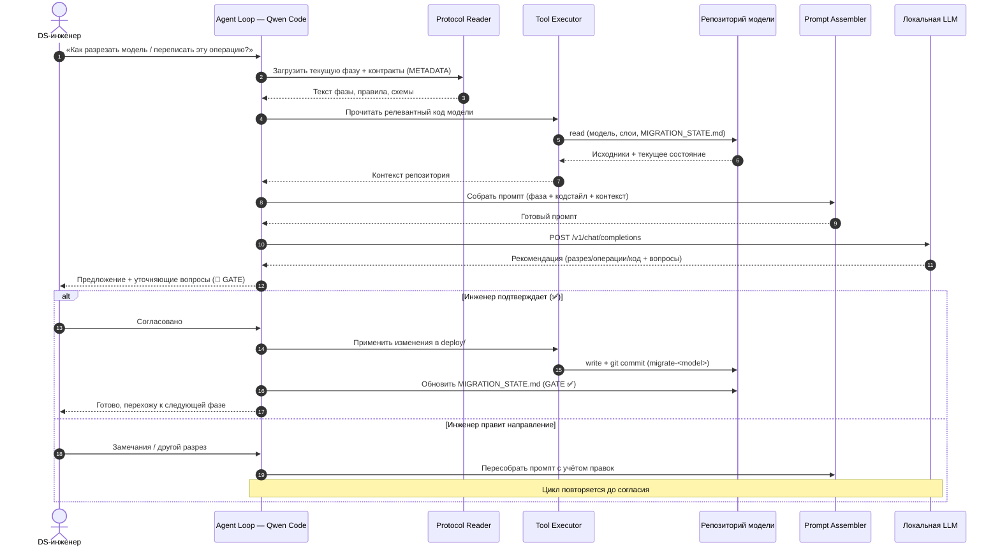

# Архитектура системы: агент интеграции библиотеки миграции

Текущая (as-is) архитектура: агентный copilot для интеграции библиотеки `migration` в
репозитории DS-команд. Раннером выступает **CLI-агент Qwen Code**, всё работает локально у
инженера; контекст собирается прямым чтением файлов (без RAG/Vector DB), состояние процесса —
в `MIGRATION_STATE.md`, история — в git.

## C2. Container Diagram

Контейнеры (в терминах C4) текущей системы. Всё работает **локально у инженера**.

> Диаграмма ведётся в Structurizr DSL: [`../workspace.dsl`](../workspace.dsl), view `MVP_C2_Container`
> (а также `MVP_C1_Context`). Отрендерить: `structurizr export -workspace workspace.dsl -format mermaid`
> или открыть онлайн на [structurizr.com/dsl](https://structurizr.com/dsl).

**Соответствие примеру из задания:**

| Пример из задания | В нашей системе |
|-------------------|-----------------|
| Frontend | CLI-агент Qwen Code (терминал инженера) |
| Backend | Агентный раннер Qwen Code (оркестрация цикла) — отдельного backend-сервиса нет |
| AI Service | Qwen Code + Локальная LLM (см. C3) |
| Vector DB | **нет** — контекст собирается чтением файлов, без RAG |
| SQL DB | **нет** — состояние в `MIGRATION_STATE.md`, история в git |

---

## C3. Component Diagram — «внутри AI Service»

«AI Service» = **Qwen Code (агентный раннер) + Локальная LLM**. Показаны реальные внутренние
части агента.

> Диаграмма ведётся в Structurizr DSL: [`../workspace.dsl`](../workspace.dsl), view `MVP_C3_Component_AIService`.
> Отрендерить: `structurizr export -workspace workspace.dsl -format mermaid` или открыть онлайн на [structurizr.com/dsl](https://structurizr.com/dsl).

**Чего из примера нет и почему:**

- **RAG Manager / Vector DB** — не реализовано: протокол компактен (навигатор + одна фаза за
  раз), контракты берутся из METADATA пакета детерминированно, поэтому векторный поиск
  избыточен. Роль «поставщика контекста» выполняет *Protocol / Guide Reader*.

---

## Sequence Diagram — «Инженер запрашивает рекомендацию»

Сценарий: инженер просит рекомендацию по непортируемой операции / схеме разреза модели
(фазы 2–3 протокола). Ключевой момент — рекомендация выдаётся, но **применяется только после
подтверждения GATE** инженером.

---

## API Spec

См. отдельный файл [`openapi.yaml`](openapi.yaml).

**Важно про транспорт.** Реального сетевого эндпоинта `/get_recommendation` в системе нет:
Qwen Code общается с «AI Service» (локальной LLM) по **OpenAI-compatible** протоколу —
`POST /v1/chat/completions`. Поэтому спецификация описывает:

1. **`/v1/chat/completions`** — фактический контракт «агент → LLM» (то, что реально есть).
2. **`/get_recommendation`** — логический эндпоинт из задания как **обёртка домена** над
   вызовом LLM (что было бы, если бы оркестрацию вынесли в отдельный сервис — целевой
   Hermes-этап). Помечен как проектируемый.
