# ADR-002: Пайплайн данных для обновления «опыта агента» (team-memory)

## Статус

Принято - 2026-11-02

## Контекст

Наш проект — `eai-migration-copilot`, агентная система на ядре
Hermes, которая ведёт **одного** DS/MLOps-инженера через 14-фазный протокол миграции модели в
рамках одной сессии.

Hermes уже предоставляет встроенные инструменты для хранения памяти (файлы `MEMORY.md`/`USER.md`)
— постоянная память на уровне одного профиля, которую пишет родительский `AIAgent` во время сессии.
Она закрывает вопрос "куда агент пишет свежий вывод во время работы". Открытый вопрос — что
происходит между сессиями разных инженеров.

Предложение по ADR:
Инженер вручную переписывает `MEMORY.md`/`USER.md` под `SKILL.md` и проходит обычный PR в соответствующем
репозиторие, аккумулирующем навыки агента.

Помимо git-репозитория с навыками предусмотрен Central Gateway (on-premise решение, владелец — роль
DevOps). Это своего рода текущее состояние навыков для Hermes-Agent.

## Источники данных

Источники "опыта" — всё, что накапливается в ходе реальных прогонов протокола миграции:

1. `MEMORY.md`/`USER.md` каждой сессии (built-in Hermes) — заметки, которые агент сам решил сохранить
   во время диалога. Покидает машину инженера только если он (инженер) сам вручную переформулирует
   находку как `SKILL.md`
2. `MIGRATION_STATE.md` (документирует состояние `migration_gate`) — по одному файлу на
   выполненную миграцию: пройденные фазы, diff-статистика, вердикты принимающего решения инженера
   и обоснования для того или иного варианта применения оптимизации.
3. GATE-решения инженера (подтвердил / опроверг) — сигнал о том, где агент был не прав.
4. SKILL.md PR'ы - (git commit/push/PR от DS/MLOps-инженера) — единственный формализованный
   способ довести локальную находку до команды.
5. Изменения самой библиотеки `migration` (новые версии, новые целевые платформы) — внешний
   относительно агента источник, попадает в skills-дистрибуцию при релизе библиотеки.

## Схема пайплайна

Природа потока — **batch/событийная** (по merge PR и по `hermes profile update`), а не непрерывный
стрим: единица "опыта" (новый/изменённый `SKILL.md`) рождается редко и ценна те, что валидируется
специалистом.

Поток состоит из двух независимых циклов, которые важно не смешивать (см. `Prod_Skill_Sharing` и
`Prod_Release_Rollback_Flow` в `workspace.dsl`):

```mermaid
flowchart LR
    subgraph ContentReview["1. Content Review — PR со skill (человеческий процесс)"]
        Eng(["DS/MLOps-инженер"])
        LocalMem["MEMORY.md / USER.md\n(built-in Hermes,\nper session — не покидает машину инженера)"]
        SkillDraft["Вручную переписано\nкак SKILL.md"]
        PR[["Git PR в skills_distribution\n(commit/push/PR —\nобычный git, без Gateway)"]]
        SO(["Skills Owner\n(ML/миграционная\nэкспертиза)"])
        MLR(["MLOps Reviewer\n(CI/deploy экспертиза)"])

        Eng --> LocalMem
        LocalMem -->|"ценная находка"| SkillDraft
        SkillDraft --> PR
        PR --> SO
        PR --> MLR
    end

    subgraph Release["2. Release — автоматически, без участия content-ролей"]
        Main[("main дистрибуции")]
        CI["CI-джоб на push тега:\nversion bump + manifest.json"]
        Manifest["Release Manifest\nService (Gateway)"]
    end

    subgraph Serving["3. Serving — раздача агенту через Gateway"]
        AdoptionT["Adoption Tracker\n(Gateway)"]
        NewSession["Новая сессия AIAgent\n(любой инженер):\nhermes profile update"]
    end

    subgraph Governance["4. Governance — обезличенные сигналы + rollback"]
        Analytics["Skill Analytics\nAggregator (Gateway):\nsuccess/failure count\nпо skill, без кода/diff"]
        SkillsOwnerRB(["Skills Owner:\nrollback(version)\n— узкое auditable право"])
        DevOps(["DevOps:\nисполняет git revert\n+ новый тег"])
    end

    SO -->|"approve"| Main
    MLR -->|"approve — merge\nтребует ОБОИХ"| Main
    Main --> CI --> Manifest
    Manifest --> AdoptionT --> NewSession
    NewSession -->|"обезличенный чекин\n+ success/failure"| Analytics
    Analytics -->|"сигнал: 'отравленный' skill"| SkillsOwnerRB
    SkillsOwnerRB --> DevOps
    DevOps -->|"git revert + тег"| Main
```

## Выбор хранилищ

| Этап | Хранилище | Обоснование выбора конкретной технологии |
|---|---|---|
| Источник истины для знаний команды (содержимое skills) | Git-репозиторий Profile Distribution (`skills_distribution` в `workspace.dsl`), тот же, что хранит `skills/` (14 фаз) и `gate_plugin` | Единственный источник истины по содержанию — то, что уже нужно для версионирования, review-процесса (PR) и атомарной публикации релизом. Заводить отдельную БД для team-memory означало бы дублировать то, что git уже даёт бесплатно |
| Метаданные о версиях (Release-манифест) | Central Gateway, `Release Manifest Service` — тонкий слой поверх git-тегов (`{version, git_tag, skills[{name,hash,phase}], changelog}`), без собственного состояния "какая версия содержимого сейчас" | Инженер не должен разбираться в git-тегах напрямую (см. [ADR-003](adr-003-hybrid-skill-distribution-gateway.md)); манифест — производный артефакт от git, генерируемый CI, а не параллельный источник правды |
| Обезличенные метрики (аналитика навыков) | Central Gateway, `Adoption Tracker` + `Skill Analytics Aggregator` — простое хранилище счётчиков (`profile_hash, skills_distribution_version, timestamp` / `skill_name, success_count, failure_count`) | Данные малого объёма, только числа — полноценная OLAP/аналитическая платформа избыточна; хранилище нужно лишь как основа для решения Skills Owner о rollback и для observability DevOps/lead |
| Векторная база данные | Не проектируется | Архитектурно отклонено на уровне всей системы — skills читаются тем же progressive disclosure механизмом (`skill_view`), а не векторным поиском |
| Feature Store | Не проектируется | Нет числовых признаков и online-инференса традиционной ML-модели. Отслеживать метрики качества модели, выбранной в качестве движка Hermes не планируется |

## Управление данными — консистентность между пользователями (DS-инженерами)

Ключевой риск не train/serving skew в классическом смысле, а его аналог — **Prompt/Context-Serving
Skew**: разные DS-инженеры в параллельных сессиях получают разные версии skills-банка и
принимают разные решения на идентичных развилках протокола.

Меры для консистентности:

1. Единая точка публикации — Central Gateway, git остаётся единственным источником истины.
   Инженер не читает skills_distribution напрямую и не подтягивает "на лету" — `hermes profile update`
   обращается только к `gw_manifest` (см. [ADR-003](adr-003-hybrid-skill-distribution-gateway.md)).
   Любая активная сессия работает с ровно одной зафиксированной версией на всё время сессии.
2. Двойное подтверждение изменения перед вливанием, без исключений по фазе.
   Каждый PR со skill требует approve и от Skills Owner (ML/миграционная экспертиза), и от
   MLOps Reviewer (CI/deploy экспертиза) — skill может затрагивать обе области (`Prod_Skill_Sharing`).
   Разделение ролей снижает риск, что содержательно неверная находка попадёт в общие знания команды
   из-за пробела в экспертизе одного ревьюера.
3. Forward-релиз автоматический, rollback — единственный ручной путь, с разделением решения/выполнения.
   CI публикует новую версию на каждый merge без участия человека.
   Единственная точка ручного вмешательства — Skills Owner видит "отравленный" skill (по сигналу
   `Skill Analytics Aggregator` или по всплеску GATE-отклонений) и вызывает узкую auditable
   операцию `rollback(version)`; техническое исполнение (git revert + новый тег) — у DevOps,
   владеющего инфраструктурой Gateway/CI. Разделение "кто решает" / "кто исполняет" не
   противоречит best practice разделения обязанностей: Skills Owner не имает решений о содержании (см.
   [ADR-003](adr-003-hybrid-skill-distribution-gateway.md)).
4. `MIGRATION_STATE.md` как единственный источник истины по факту миграции. Описанный процесс
   не вводит новый формат, а переиспользует существующий файл-контракт.
5. Согласованность между ролями DS/MLOps. Обе роли работают с одной и той же дистрибуцией —
   `workspace.dsl` описывает `engineer` (фазы 0-11) и `mlops` (фазы 12+) как один и тот же
   Hermes-профиль с ручной проверкой на GATE, а не два разных профиля — team-memory не
   разделяется по роли.
6. Инвариант памяти не нарушается. Ни Central Gateway, ни Adoption/Skill Analytics не получаю
   доступа к `MEMORY.md`/`USER.md` — туда уходят только метаданные о версиях и обезличенные числовые
   счётчики, никогда факты, код или diff.

## Последствия

### Преимущества

- Не введено ни одного избыточного хранилища для содержимого — team-knowledge переиспользует
  git-репозиторий Profile Distribution; Central Gateway хранит только производные метаданные
  (манифест, обезличенные счётчики), не дублирует git.
- Двойной approval снижает риск ошибок по содержанию в командных знании лучше, чем единственный `lead`.
  Cпециализация ревьюеров соответствует специализации самих фаз протокола.
- Явный, rollback-путь с разделением ответственности: решение принимает владелец Skills, исполнение - DevOps.
- Полный трейсинг: находка → PR → double-approval merge → CI-релиз → Gateway manifest → раздача
  → обезличенная статистика → (при необходимости) rollback — каждый шаг воспроизводим.

### Риски

- Двойной approval увеличивает цикл ревью (нужны оба ревьюера) по сравнению с единственным
  `lead` — осознанный компромисс качества content-review за счёт скорости.
- Central Gateway — новый эксплуатируемый сервис (пусть и тонкий над git), требует владельца
  и мониторинга собственной доступности — если Gateway недоступен, `hermes profile
  update` не работает, даже если git доступен.
- Rollback остаётся привязан к обычному релизному циклу CI — не мгновенный,
  ограничен временем прогона CI-джобы, в обмен на то, что git остаётся единственным источником
  истины и не появляется второе состояние "активная версия" для рассинхронизации.
- Feature Store и Vector DB осознанно не проектируются — если архитектура впоследствии
  откажется от progressive disclosure в пользу векторного поиска по большой неструктурированной
  базе знаний, или появится числовая ML-модель с online-инференсом, этот ADR потребует
  пересмотра.
